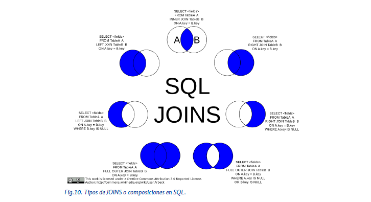

# 📘 Tema 11 — Consultas Multitabla y Subconsultas

---

## 📑 Índice

- [1. Introducción](#1-introducción)
- [2. Consultas sobre varias tablas](#2-consultas-sobre-varias-tablas)
- [3. Composiciones internas](#3-composiciones-internas)
  - [3.1. INNER JOIN](#31-inner-join-join)
  - [3.2. NATURAL JOIN](#32-natural-join)
- [4. Producto cartesiano (CROSS JOIN)](#4-producto-cartesiano-cross-join)
- [5. Composiciones externas](#5-composiciones-externas)
  - [5.1. LEFT JOIN](#51-left-join)
  - [5.2. RIGHT JOIN](#52-right-join)
  - [5.3. FULL OUTER JOIN](#53-full-outer-join)
- [6. Subconsultas](#6-subconsultas)
- [7. Tipos de subconsultas](#7-tipos-de-subconsultas)
- [8. Subconsultas de varias filas](#8-subconsultas-de-varias-filas)
- [9. EXISTS y NOT EXISTS](#9-exists-y-not-exists)
- [10. Subconsultas con GROUP BY y HAVING](#10-subconsultas-con-group-by-y-having)
- [11. Operaciones de conjuntos](#11-operaciones-de-conjuntos)
- [12. Ordenación](#12-ordenación)
- [Esquema resumen](#-esquema-resumen)


---

## 1. Introducción

En temas anteriores hemos trabajado consultas sobre **una sola tabla**.  
Sin embargo, una de las grandes ventajas de las **bases de datos relacionales** es distribuir la información en **varias tablas relacionadas**, evitando duplicidades.

👉 En este tema aprenderemos a:
- Realizar **consultas multitabla**
- Usar **JOINs**
- Crear y entender **subconsultas**
- Aplicar **operaciones de conjuntos** (UNION, INTERSECT, MINUS)

---

## 2. Consultas sobre varias tablas

Las tablas se relacionan mediante:
- **Clave primaria (PK)** en una tabla
- **Clave foránea (FK)** en otra

Para consultar datos de varias tablas se usa `SELECT` junto con **JOIN**, lo que se denomina:

> 🔹 **Consulta multitabla**

### Tipos de composiciones

| Tipo | Cláusulas |
|----|----|
| **Internas** | INNER JOIN, NATURAL JOIN |
| **Externas** | LEFT JOIN, RIGHT JOIN, FULL OUTER JOIN |
| **Cruzadas** | CROSS JOIN |

---

## 3. Composiciones internas

### 3.1. INNER JOIN (JOIN)

Devuelve **solo las filas que coinciden** en ambas tablas.

```sql
SELECT e.nombre, s.nombre_sucursal
FROM empleados e
INNER JOIN sucursales s
ON e.cod_sucursal = s.cod_sucursal;
```

📌 Si no hay coincidencia → **no aparece en el resultado**

---

### 3.2. NATURAL JOIN

Une automáticamente las tablas por **columnas con el mismo nombre y tipo**.

```sql
SELECT nombre, nombre_sucursal
FROM empleados
NATURAL JOIN sucursales;
```

⚠️ Puede ser peligroso si hay columnas con el mismo nombre que **no deberían relacionarse**.

---

## 4. Producto cartesiano (CROSS JOIN)

Combina **todas las filas de una tabla con todas las filas de otra**.

```
Filas finales = filas_tabla1 × filas_tabla2
```

```sql
SELECT *
FROM tareas
CROSS JOIN empleados;
```

---

## 5. Composiciones externas

### 5.1. LEFT JOIN

Toma todas las filas de la tabla de la izquierda y las combina con las filas coincidentes de la tabla de la derecha. Si no hay coincidencias, muestra las filas de la izquierda y pone NULL en las columnas de la derecha

```sql
SELECT e.nombre, s.nombre_sucursal
FROM empleados e
LEFT JOIN sucursales s
ON e.cod_sucursal = s.cod_sucursal;
```

---

### 5.2. RIGHT JOIN

Toma todas las filas de la tabla de la derecha y las combina con las filas coincidentes de la tabla de la izquierda. Si no hay coincidencias, muestra las columnas de todas las filas de la tabla derecha y pone NULL en las columnas de la tabla izquierda.

```sql
SELECT e.nombre, s.nombre_sucursal
FROM empleados e
RIGHT JOIN sucursales s
ON e.cod_sucursal = s.cod_sucursal;
```

---

### 5.3. FULL OUTER JOIN (❌ No soportado por MySQL)

Combina todas las filas de ambas tablas. Muestra las filas con coincidencias y también las filas sin coincidencias, poniendo NULL donde no haya datos.

```sql
SELECT *
FROM empleados
FULL OUTER JOIN sucursales
ON empleados.cod_sucursal = sucursales.cod_sucursal;
```



---

## 6. Subconsultas

Una **subconsulta** es una consulta dentro de otra.

```sql
SELECT *
FROM empleados
WHERE salario >
(
    SELECT salario
    FROM empleados
    WHERE nombre = 'Martina'
);
```

---

**Tipos de subconsultas**

| Tipo | Resultado |
|----|----|
| Escalar | 1 fila, 1 columna |
| De fila | 1 fila |
| De tabla | Varias filas |

---

### 7.1. Subconsultas de varias filas

| Operador | Uso |
|----|----|
| ALL | Cumple para todos |
| ANY/SOME | Cumple para alguno |
| IN | Está en el conjunto |
| NOT IN | No está en el conjunto |

---

## 9. EXISTS y NOT EXISTS

```sql
SELECT nombre
FROM productos p
WHERE EXISTS (
    SELECT *
    FROM almacen a
    WHERE a.id_producto = p.id_producto
);
```

---

## 10. Subconsultas con GROUP BY y HAVING

```sql
SELECT departamento
FROM empleados
GROUP BY departamento
HAVING AVG(salario) >
    (SELECT AVG(salario) FROM empleados);
```

---

## 11. Operaciones de conjuntos

### UNION

```sql
SELECT nombre FROM empleados
UNION
SELECT nombre FROM clientes;
```
-- NO SALE:
### INTERSECT

```sql
SELECT id_producto FROM almacen1
INTERSECT
SELECT id_producto FROM almacen2;
```
-- NO SALE:
### MINUS / EXCEPT

```sql
SELECT id_producto FROM almacen1
MINUS
SELECT id_producto FROM almacen2;
```

---

## 12. Ordenación

```sql
SELECT nombre FROM empleados
UNION
SELECT nombre FROM clientes
ORDER BY nombre;
```

---

## 🧾 Esquema resumen

```
JOINs → INNER | LEFT | RIGHT | FULL | CROSS
Subconsultas → Escalares | Fila | Tabla
Operadores → ALL | ANY | IN | EXISTS
Conjuntos → UNION | INTERSECT | MINUS
```
